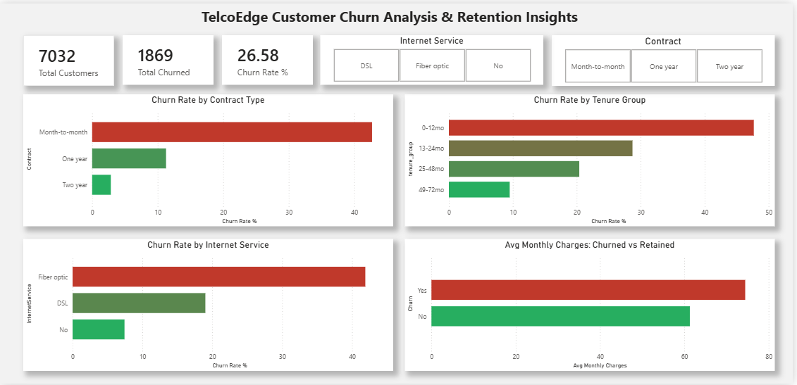

# TelcoEdge Customer Churn Analysis & Retention Insights

## Business Problem
TelcoEdge has been experiencing increasing customer churn with no clear understanding of the underlying drivers. 
This project analyzes customer data to identify churn patterns, build a high-risk customer profile, and provide actionable retention recommendations.

## Dataset
- Source: Telco Customer Churn Dataset (Kaggle)
- Records: 7,032 customers after cleaning
- Features: 21 variables including demographics, services, contract type, payment method, and charges
- Link: https://www.kaggle.com/datasets/blastchar/telco-customer-churn

## Tools Used
- Python (Pandas, NumPy) — data cleaning and exploratory analysis
- MySQL — business question analysis using SQL queries
- Microsoft Power BI — interactive dashboard and data visualization

## Data Cleaning Process
- Identified 11 rows with missing TotalCharges values, all had tenure = 0 indicating new customers with no billing history. Dropped these rows as they carry no churn signal.
- Converted TotalCharges from string to float after resolving hidden whitespace values
- Converted SeniorCitizen from integer (0/1) to categorical (No/Yes) for clarity
- Created Churn_Binary column (0/1) to enable numeric aggregation

## Key Findings
1. Overall churn rate is 26.58% (1,869 of 7,032 customers)
2. Month-to-month contracts have a 42.71% churn rate vs 2.85% for two-year contracts
Hypothesis: Month-to-month customers have no switching cost or commitment. The absence of contract lock-in combined with early tenure vulnerability creates the highest churn risk window.
3. Fiber optic customers churn at 41.89% (the highest of any internet service type)
Hypothesis: Fiber optic customers pay premium prices but may experience service quality issues or find better alternatives. Without customer satisfaction data we cannot confirm causation, but the pricing gap between churned ($74.44) and retained ($61.31) customers supports a value perception problem.
4. The highest risk segment is Fiber optic + Month-to-month = 54.61% churn rate
5. Churned customers pay more on average ($74.44 vs $61.31 monthly) but leave sooner (17.98 vs 37.65 months tenure)
6. Electronic check payment method correlates with 45.29% churn rate
7. Customers without TechSupport or OnlineSecurity churn at ~42% vs ~15% for those with these services

## Business Recommendations
1. Investigate Fiber optic service quality and pricing. The data suggests a value perception problem,
customers are paying premium prices but leaving faster than lower-tier customers. 
TelcoEdge should audit service complaints and satisfaction scores for this segment specifically.
2. Implement an early tenure retention program targeting month-to-month customers in their first 12 months. 
This is the highest risk customer segment. Proactive outreach and incentives to upgrade to annual contracts during onboarding would directly decrease the largest churn segment.
3. Bundle TechSupport and OnlineSecurity into Fiber optic packages to increase perceived value and reduce churn
4. Incentivize electronic check users to switch to automatic payment methods. Electronic check correlates with 45.29% churn (the highest of any payment method). Automatic payment reduces friction and correlates with lower churn rates.
5. Prioritize retention efforts toward senior citizens on month-to-month contracts. 
   Senior citizens churn at 41.68% vs 23.65% for non-seniors, and are likely more vulnerable to competitor offers without proactive engagement.

## Key SQL Queries
### Churn Rate by Contract Type
```sql
SELECT Contract,
       COUNT(customerID) AS total_customers,
       SUM(Churn_Binary) AS total_churned,
       ROUND(AVG(Churn_Binary) * 100, 2) AS churn_rate_pct
FROM telco
GROUP BY Contract
ORDER BY churn_rate_pct DESC;
```
This query reveals that month-to-month customers churn at 42.71%, 
15x higher than two-year contract customers at 2.85%.

### Highest Risk Segment
```sql
SELECT InternetService, Contract,
       ROUND(AVG(Churn_Binary) * 100, 2) AS churn_rate_pct
FROM telco
GROUP BY InternetService, Contract
ORDER BY churn_rate_pct DESC;
```
Fiber optic combined with month-to-month contract produces a 54.61% 
churn rate, the single highest risk combination in the dataset.

## Dataset Limitations
- This is a public Kaggle dataset with no real business context or verified accuracy
- Correlation findings cannot be interpreted as causation without additional data
- No customer satisfaction, complaint, or service quality data is available to 
  confirm hypotheses about why fiber optic customers churn
- Dataset covers a single snapshot period with no seasonality information
- External factors such as competitor pricing or market conditions are not captured

## Dashboard Preview



